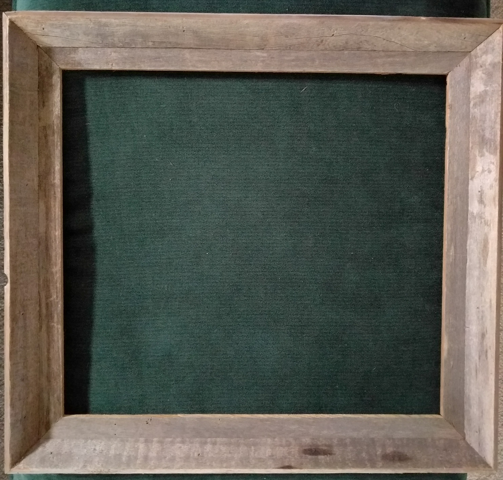
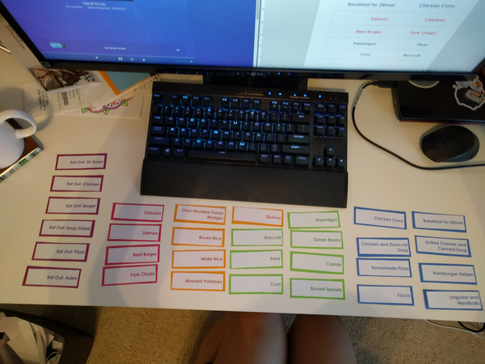

*A project from September 2017...*

Like most people, Derek and I always struggle to figure out what to make for dinner.
Either we end up spending too much on eating out, or by the time we finally decide what to make,
it's 10pm, and almost time for bed (young adults around the world will know the struggle).

SOOOO, introducing **the menu board**! *trumpet fanfare*

I drew some inspiration from Pinterest on this one, to get an idea of what it should all entail.
A lot of the menu boards I saw were pretty poorly made and not that aesthetically pleasing.
I figured if I wanted to make this as a gift for Derek, it needed to meet his expectations.
(As well as mine!)

I happened to have an old wooden frame laying around that my sister had actually bought a while back
and wasn't using:

I decided that because I want this to be hang-able, the backing for this should be pretty lightweight.
I went with some black foamcore, so I could do some stenciling on it as well. I wanted to be able to have
menu cards for different food items that could be combined for a meal. I also wanted a way to keep a pen and
notepad on the board for writing down the groceries for that week, something to hold the menu items, etc.

Here's what it took to make the board and "accessories":

- Wooden frame
- Black foamcore
- Pearl craft paint
- Stencil lettering
- 2" clothespins
- Decorative flowers
- Magnetic locker pencil holder
- Pack of lines sticky notes
- Some cardstock paper

I handmade the menu cards with just some labels printed from a template I created in Microsoft Word,
and then some colored cardstock paper to give it some nice weightiness. I color-coded the different
types of food, red for protein, green for veggies, orange for starches, etc. *(peep the Corsair K65 keyboard- no numpad FTW!)*:

The other work I put into this, other than some lovely hot-gluing, was painting the locker pencil holder.
I had this old one that was silver and didn't quite match the look of what I was going for. I removed the magnet
on the back, and spray painted it black.

So when you put it all together, this is what you get:

