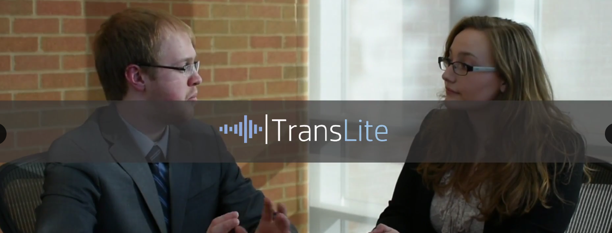
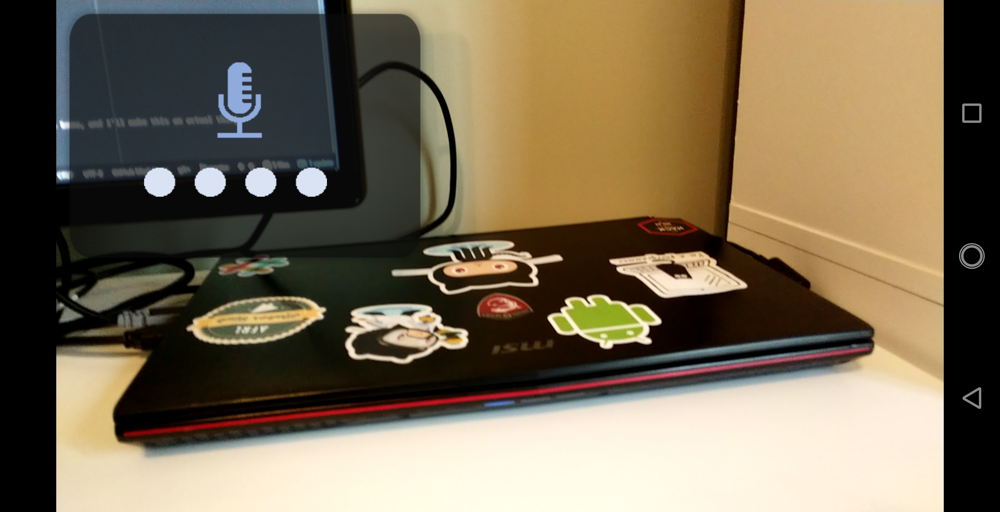
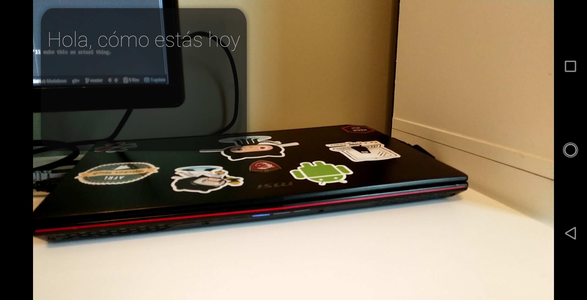

So for my distributed computing class at Wright State, we had a semester-long project to work on.
The goal of the project was to kind of get us to not only work on the technical aspects of the project,
but to work on "selling a product", and go through the process of a project pitch -> design -> implementation.

The general theme of the project was to develop *some* kind of application that was related to translation.
I tried to think of some ideas that would really help our idea stand out above the rest, so I did some research
into the existing solutions, most of which consisted of mobile or PC applications. I had just been watching a video
that morning that was talking about the new AR glasses that were released at CES 2018, and the idea struck! What if
there was an application for AR glasses, that would translate real-time "subtitles" to your own language?

Hence, TransLite was born!

### About

TransLite is my idea for a lightweight (in terms of user experience) translation application for Google Glass.
This video I put together for the project pretty much says it all. Shoutout to John and I's great acting skills:

### Status

Because I didn't have access to Google Glass for actual development, the current prototype is just an Android application
that simulates a Google Glass experience and an immersive card layout.

Check out the project in my [GitHub repository](https://github.com/kristavan/TransLite)!

Unfortunately, because I'm using the Google Cloud Translation API for the translation process, I can't offer up the ever-so-secret API key for free. You can, however get your own API key and edit the source to play around with the app.

### Demo Application Screenshots

   

Here's the basic settings menu. We set the input language to be English, and the output language to be Spanish.
That checkmark lets us record the conversation, and store it to a text file on the system.

---

Press the down volume to start voice capture. Note the cute little microphone gif (handmade gifs can be a pain!).

---

I said "Hello, how are you today?" in English, and we see the translated text in Spanish on the card!

   

<b>
Would you be interested in an application like this?
</b>
If you've got an extra pair of Google glasses laying around, let me know, and I'll make this an actual thing.

