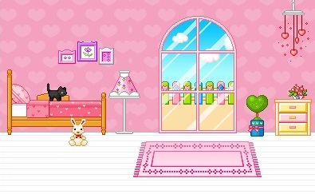
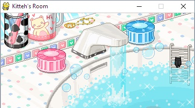

So back in 2016 or so, I decided to try and get my hands dirty with the pygame library for Python.
I didn't know what kind of game I wanted to make, or how far I wanted to go, so I just started playing around
with some things and found that I could find some cute kitty sprites! From there, PyKitty was born!

I've spent maybe just a couple hours tinkering with this. Maybe I can get back to it at some point and do some
more interesting things like adding boundary conditions for the rooms, different interactions, maybe a fun
little story line or something.

The current iteration lies at this [GitHub repository](https://github.com/kristavan/PyKitty)

   

|  | Kitty starts in the bedroom, posted on the bed. Ready for adventure! |
|  | If kitty travels to the left side of the screen, he can check out the living room! Looks like there's a party going on, but kitty is crashing it! Get off the table, kitty! |
|  | After a long, hard day kitty needs to take a hot bath. Looks like he just finished. |
