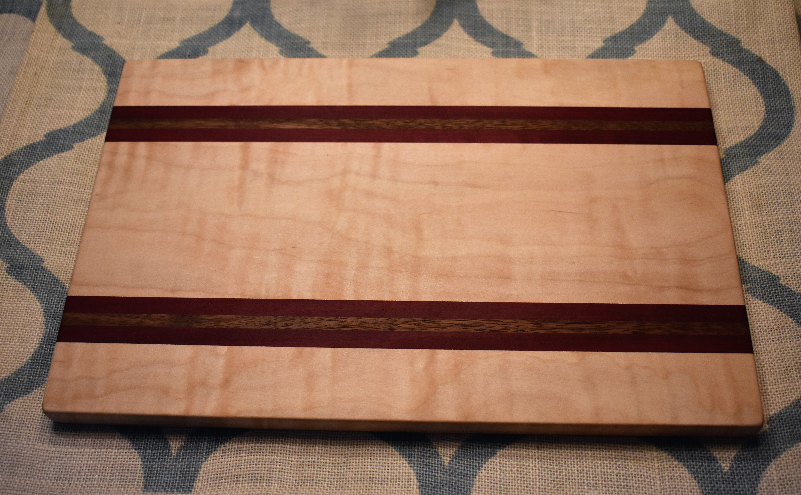
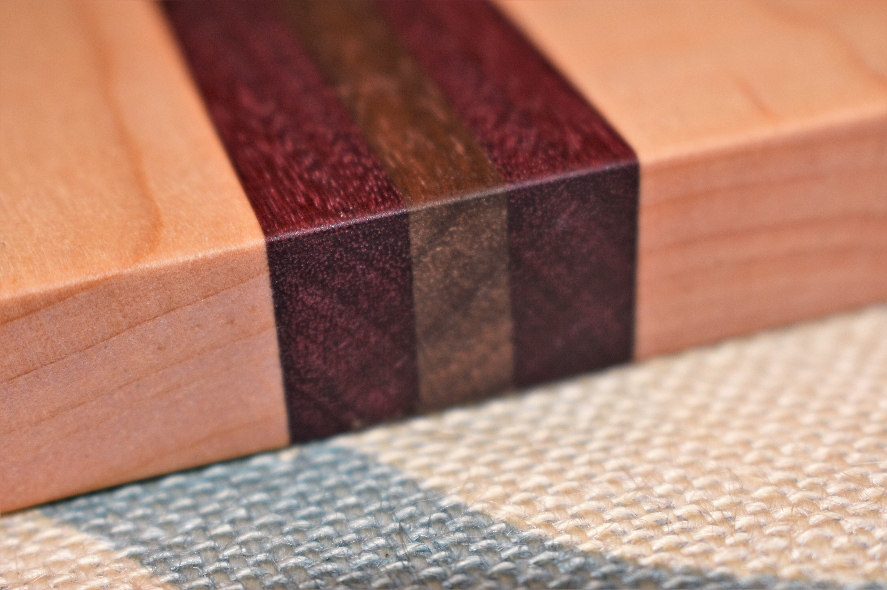

Mom never seems to have enough cutting boards, so I decided to make her one for Mother's Day!
The majority of the board is (curly) maple, and two racing stripes made up of some walnut sandwiched between
two thin strips of purpleheart.

<figure>
  
  <figcaption>The final product!</figcaption>
</figure>

<figure>
  
  <figcaption>Close-up of walnut/purpleheart striping</figcaption>
</figure>

