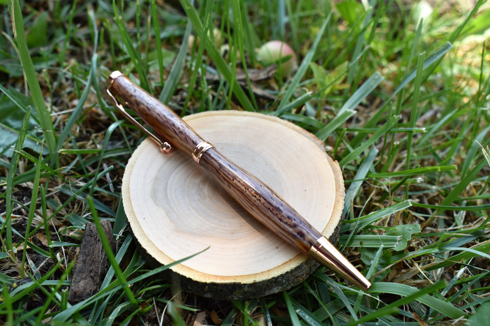
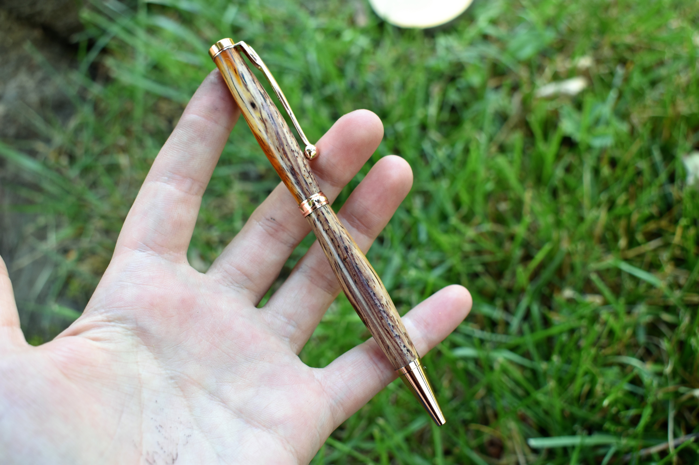

I finally got the courage to turn my first pen. This was in preparation of wanting to make dad a pen for Father's Day 2018 (see [this post](https://kristavan.github.io/fathers-day-pen/)). It was a pretty quick and simple process. It's a slim-line pen made out of Cocobolo, which is really easy to work with. I used some copper hardware, and finished it off with a shellac friction polish.

