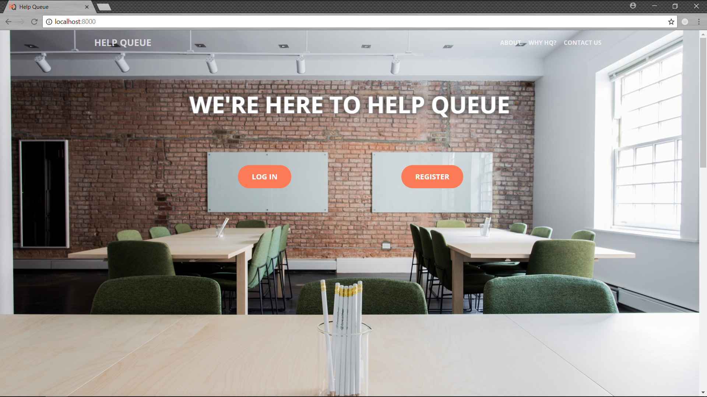
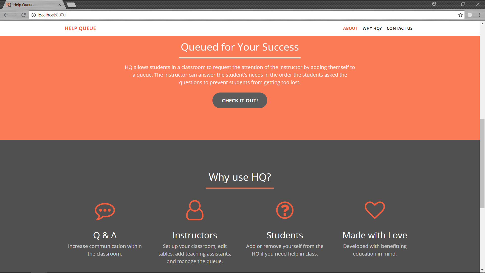

The idea for the project started back in my sophomore year of college. I was sitting in my computer organization lab and there were about 25-30 students in the lab trying to get signed off on their lab progress so they could move on to the next grueling task. The problem, though, is that there was only one TA for all of us students, and he would take his time getting around to every person, wouldn't know who had their hand up first, who to prioritize, etc.

If only there was a way to queue up the students so the TA would know who needed help first (either first come, first serve or level of progress, etc.)...

I didn't get around to actually implementing anything until I decided to participate in Wright State's spring hackathon. As vice president of the ACM club, I was usually helping out with the logistics of planning the event and deterring any 2am shenanigans when all the programmers had had too many caffeinated beverages. BUT I decided to take a backseat in the 2017 hackathon planning and get my hands dirty with some Django. I grabbed a couple of friends and we worked all through the night with about 30 minutes of sleep.

  

### HelpQueue (HQ)

So as mentioned, the issue with lab rooms or large interactive classrooms, is that the professor/TA doesn't have a good way to prioritize the students in their class. So the goal was to create a web application whereby students could add or remove their name from a help queue during class, so that they did not get overlooked in the wave of students. The professors could then check the help queue in real-time to prioritize the students' needs.

Because I wanted the app to be quickly and easily accessible by students and professors (and because I had never done anything like it before), I decided a web application would be a good solution for this project. We used the Python web framework, Django to implement HQ.

During the hackathon, we started working on the project from the ground up, and managed to get the skeleton of a working application going. The front page, which is of course the selling point, was completed. We added user registration and authentication. We also started working on the layout of the student and professor pages, but didn't have any time to go further. Here are some screenshots of the progress we made:

<figure>
  
  <figcaption>Top of the main page of the HelpQueue site </figcaption>
</figure>

<figure>
  
  <figcaption>Further down on the main page of the HelpQueue site </figcaption>
</figure>

HelpQueue was a great project to get familiar with web application frameworks like Django, and a good opportunity to reacquaint myself with CSS/HTML.
